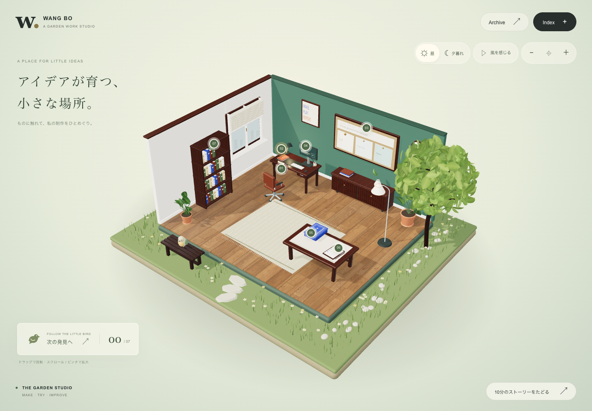
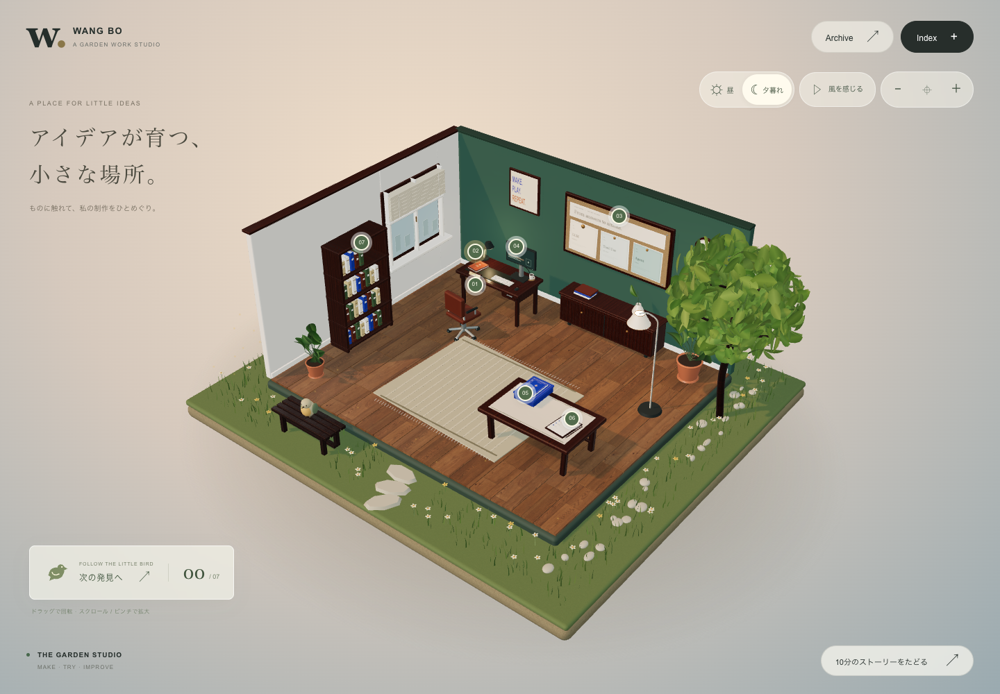
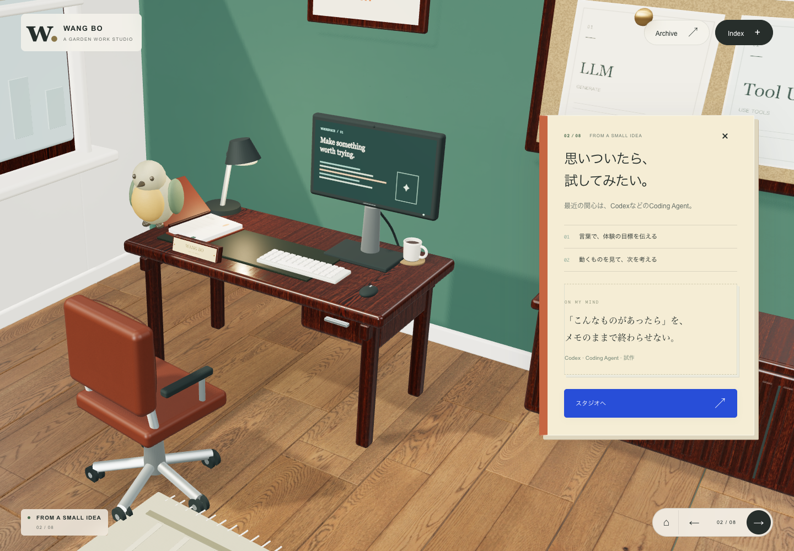
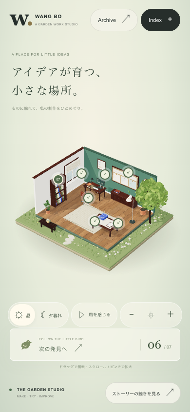

# 庭院工作室

在已完成的精细材质工作室外加入一个夏日下午的微缩庭院。物件仍承载原有八章内容，小鸟帮助访客找到下一处，点击后镜头靠近并展开正文。原来的 24 页资料、日语讲稿、Day Card、Agent 演示和独立 Atlas 继续可用。



## 参考如何落地

| 用户提供的参考 | 本次采用的方向 |
| --- | --- |
| [Bruno Simon](https://bruno-simon.com/) | 物件就是入口；既能直接点模型，也有可键盘操作的热点。 |
| [Summer Afternoon](https://summer-afternoon.vlucendo.com/) | 温暖、安静的小世界；草地、树冠、木材、石径形成统一配色。 |
| [My Little Storybook](https://exp-my-little-storybook.lusion.co/) | 小鸟随章节移动，镜头与内容共同形成探索顺序。 |
| [Choo Choo World](https://choochooworld.com/) | 微缩场景可以旋转、缩放、重置，并切换时间氛围。 |
| [Lusion](https://lusion.co/) | 让大面积场景与留白、简短标题、克制的导航共同构图。 |
| [Igloo Inc.](https://www.igloo.inc/)、[Messenger](https://messenger.abeto.co/)、[Abeto](https://abeto.co/) | 作为展品、角色与单一自然主题的补充参考；保持工作室自身的题材。 |

没有复制参考站的代码、角色或素材。庭院、树叶、野花、小鸟和引导图标均为本项目原创几何或绘制内容。已有摄影 PBR 贴图仍全部从本地加载，来源与授权见 [MODEL_REFINEMENT.md](MODEL_REFINEMENT.md)。此轮直接使用现有 Three.js 建模流程。

## 模型与氛围

- 草地有细密纹理和高低变化，1,150 片草叶与野花采用实例化绘制。树冠由 780 片带叶脉、折面的叶片组成，树干与木长椅沿用真实木纹材质。
- 新增独立的石径、园边卵石、长椅与小鸟。小鸟包含翅膀、尾羽、喙、眼睛与脚，转场时沿弧线飞向当前物件。
- 白天与夕暮切换天空、主光、环境反射和灯泡亮度；夕暮可见少量萤火。树冠与小鸟的轻微动作可暂停。
- 名牌、笔记本、显示器、研究板、卡牌、检查清单、书架和 Atlas 的材质细节沿用上一轮完成的模型优化。




## 操作

- 点击七个编号热点或物件，打开对应内容。已探索的入口显示勾号。
- “次の発見へ”依次打开尚未探索的物件。进度保存在当前标签页会话中，刷新可恢复；七处完成后可重新开始。
- 全景下拖动旋转、滚轮或双指缩放；也有放大、缩小、复位按钮。
- 昼 / 夕暮切换光照。“ひと休み”暂停庭院动作。系统要求减少动态效果时，默认静止，镜头和小鸟直接到位；访客仍可主动开启庭院微动。
- 小屏幕的物件按钮保持 44px 点击区域，并自动错开；细线保留按钮与物件的对应关系。
- 原有 Index、Archive、方向键、Esc、发表计时和文字备用入口保持原有操作。



## 验证

在实际生产导出包 `dist/client` 上完成 **35 / 35 项检查**，记录保存在 [verification.json](docs/garden-studio/verification.json)。

| 检查 | 结果 |
| --- | --- |
| 原工作室回归 | 22 / 22：八章、实际模型点击、Agent、抽卡、资料、键盘、计时、触控、WebGL 恢复 |
| 庭院交互 | 7 / 7：昼夕、七处导览、保存与重启、旋转缩放复位、热点间距、双指缩放、动效暂停 |
| 材质与 Atlas | 6 / 6：全部 13 张贴图、延迟加载重绘、丢失贴图备用、全部近景、Atlas 13 个资产的两种视图 |
| 布局 | 1440×1000、1366×768、820×1180、390×844、320×720 |
| 静态检查 | TypeScript 与修改范围 ESLint 通过 |
| 生产构建 | 通过；保留 Three.js 等大模块的包体提示 |

本机 Google Chrome / Apple M4 Metal、1440×1000 的五组章节切换采样中，浏览器刷新回调约 60.1–60.3 次/秒，均保持标准画质。这是该设备的响应性记录，不代表所有设备的帧率。静止场景不持续渲染；庭院微动限制为约 30 帧/秒，实测 1.1 秒绘制 33 帧。打开资料、讲者备注或隐藏页面时暂停绘制。缓慢设备仍可自动降低分辨率及关闭阴影。

复现方式（先按 README 启动本地服务）：

```sh
pnpm typecheck
pnpm build
node tests/garden.test.mjs
node tests/studio-fullscreen.test.mjs
node tests/materials.test.mjs
```

测试支持 `PLAYWRIGHT_MODULE` 指定已安装的 Playwright 模块、`PLAYWRIGHT_CHANNEL` 指定浏览器，`STUDIO_URL` 默认 `http://127.0.0.1:5173/`。未增加运行依赖或外部材质请求。
