# 花园工作室：PC 展示版

2026-10-01 更新。首页以居中的完整花园工作室为主体，底部简短的「はじめる」从个人介绍开始。个人笔记、显示器、全息投影器承载五个章节，书架仅用于参考资料，正文始终附着在实际模型表面；章节之间直接运镜，不绕回全景，也不在抵达后替换成独立页面。本轮只以 PC 为设计和验证目标。

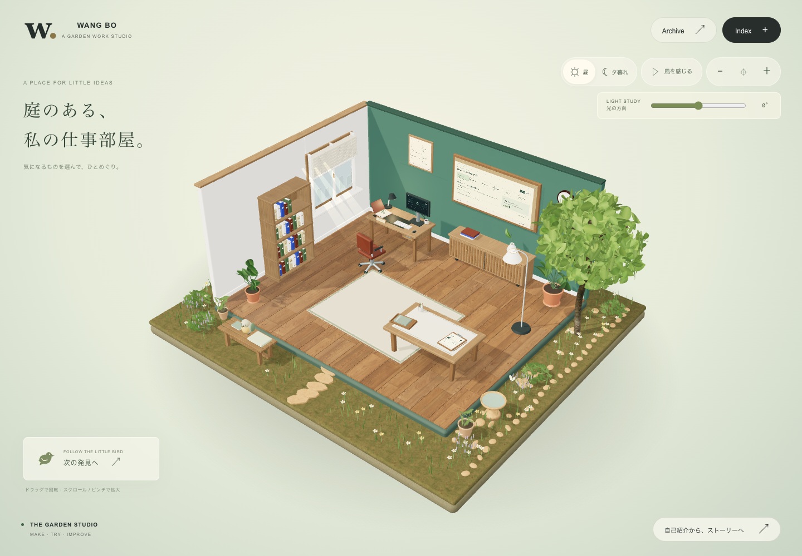

## 内容与讲解顺序

| 章节 | 对应物件 | 表达重点 | 操作込み目安 |
| --- | --- | --- | --- |
| 自己紹介 | 中央茶几上的个人笔记 | 姓名、研究领域，以及 KIOXIA / 日立ハイテク两段经历。Multi Beam 与 ADC 合并在当前职责中 | 0:00–0:40 |
| AIとの距離が変わるまで | 个人笔记的下一页 | 从 Transformer、ViT、首次接触 GPT，讲到如今与 AI 一起工作 | 0:40–1:55 |
| LLMを使う仕組みの広がり | 桌上的电脑 | 用同一个活动报名网页，比较「答える」「実行する」「進める」 | 1:55–3:25 |
| Agentの構成と実行過程 | 桌上的电脑 | 先讲 Harness、完整 Agent Loop 与执行停止条件，再介绍 2021–2026 的发展、并行路线与技术基盘 | 3:25–7:35 |
| AIを活用した製品開発 | 右侧作品柜上的全息投影器 | 从问题、规格、实现、验证到运用；再讨论生成 AI 快速发展时，如何最大化发挥自己的价值 | 7:35–10:25 |

完整日语讲稿见 [STUDIO_SCRIPT_JA.md](STUDIO_SCRIPT_JA.md)，与讲者备注共用内容。时间是包含操作的规划值，尚未经过讲者本人音读排练。KIOXIA 的起始年份未获确认，因此保留「2023年以前」，没有把建议中的示例年份 2019 写成实际履历。

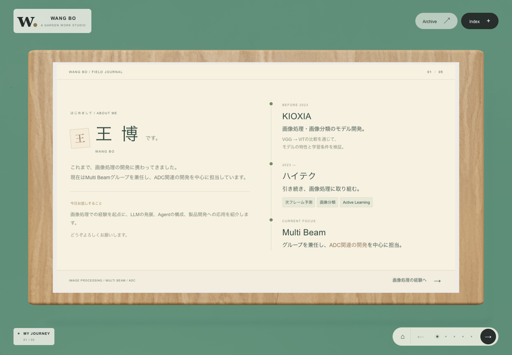
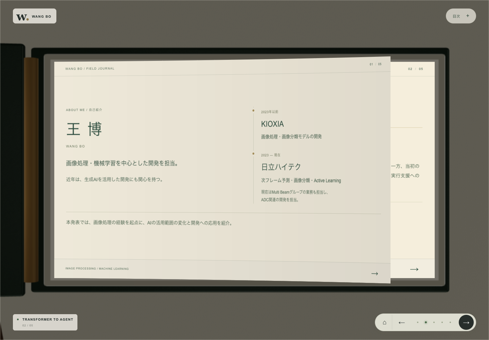
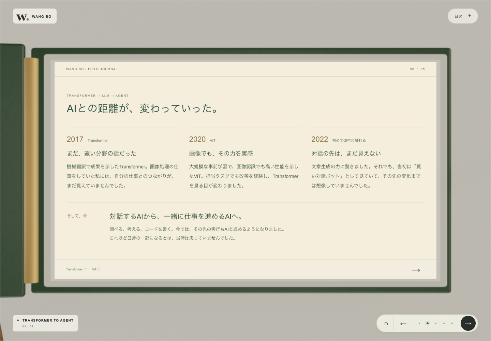
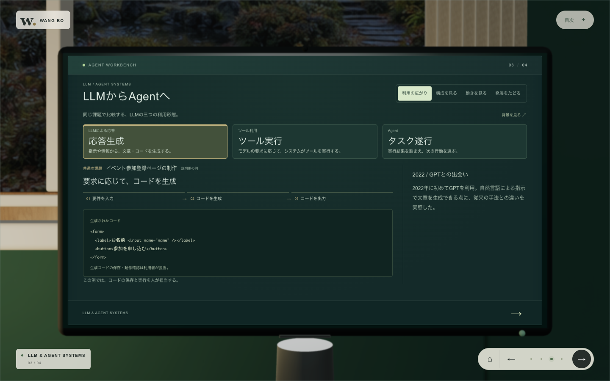

## 机制与事实边界

- **个人介绍**：保留姓名、工作经历与当前职责，不使用职位标签，只说明工作围绕图像处理与机器学习展开。移除方框印章和技能标签，用自然叙述连接主题。
- **第二章导入**：移除图像分类原理、Patch 操作和模型比较课。2017 年 Transformer 先在机器翻译上展示成果；2020 年 ViT 在大规模预训练后表现出图像识别能力；2022 是讲者首次接触 GPT 的时间。随后连接今天利用 AI 推进工作的变化。感受直接用第一人称表达，不把个人认识顺序写成技术起源，也不声称所有人都离不开 AI。
- **LLM 使用方式**：三张卡片是唯一主导航。生成代码、系统执行文件工具、依据浏览器反馈修正三个例子都围绕活动报名网页。Tool Use 不限于一次调用，Agent 仍使用模型和工具；三者不表示互相替代的三代技术。
- **个人体会与技术背景**：2022 首次体验 GPT 出现在第二章叙事，并在「答える」中呼应。API 工具、OpenClaw、Claude Code 和 Codex 直接以讲者口吻叙述，不显示「私の体験」或重复的身份说明。六个技术节点及一次资料收进「背景を見る」窗口，Escape 只关闭窗口，保留当前章节。
- **Agent**：Harness 管理模型调用、工具调度、状态和权限 / 次数 / 时间限制；Model 生成调用请求，Harness 依据权限与规则执行、等待批准或阻止。Agent Loop 指 Context → Model → 工具执行 → 结果／观测 → Context 的完整循环；返回箭头只标「結果を文脈に反映」。执行成功与任务达成分开判断，测试、规则、模型、人工验证按任务需要选择。框表示运行职责，并不限定物理部署位置。结构可逐项选择，运行演示包括正常交付、检查次数达到上限、浏览器权限不足三条分支。
- **产品示例**：日志差分工具是明确标注的企划例；此网站是实际制作例。作品柜以固定全息底座投出产品开发画面；左侧陈列书册与陶盆绿植，不再摆放含义不明的小房间模型。最后的讨论直接提出「生成AIが急速に発展する今、私たちはどうすれば、自分たちの価値を最大限に発揮できるか」，不显示「議論の論点」标签。

Agent 演示按「目标 → 生成代码 → 浏览器检查 → 发现按钮超出 → 修正 → 复验 → 交付」播放。每一步只高亮当前节点，结果加入 Context。320px 是该教学情境中的验收宽度，不代表此网站在做手机端适配。整个演示明确标注为本地模拟，未连接 AI 或真实浏览器检查服务。「できた」的回答不能替代验收；受阻或达到上限时停止，并向人说明未完成项。

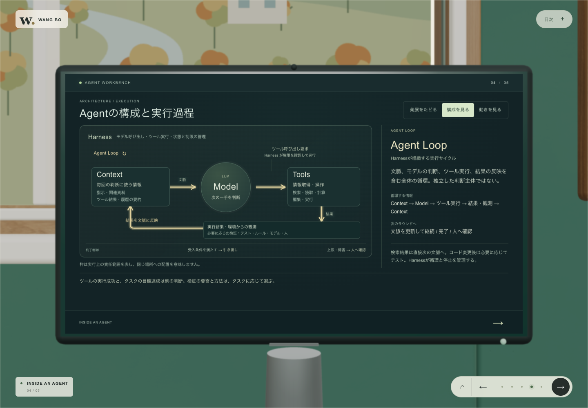


第四章按「構成を見る → 動きを見る → 発展をたどる」排列。发展内容是第四章的最后一部分，之后进入产品开发。页面右下角只显示箭头，操作名称保留在无障碍标签中。第一、二章共用个人笔记，第三、四章共用显示器；同一本子内用约1.05秒的纸张翻页，不移动镜头。电脑两章统一深绿色屏幕，使用约0.3秒的淡入切换，内部选项也使用轻微屏幕过渡。减少动态效果时直接切换。物件之间保持连续移动。

新增内容按 **2026-09-30** 截止范围整理，来源复核日为 **2026-10-01**。不是全部产品目录，也不把分类、框架或协议排列为替代关系。日期采用月／年粒度；OpenClaw 区分 2025 年 11 月前身与 2026 年 1 月改名，2021 年 Codex 模型与 2025 年 Agent 产品也明确分开。详见[来源与整理说明](docs/model-presentation/agent-development-sources.md)。

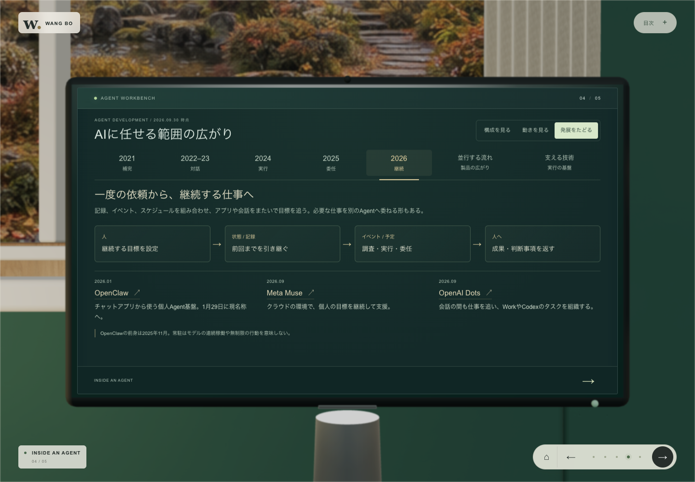
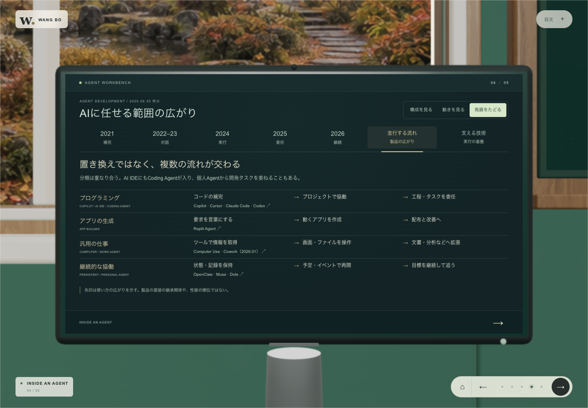
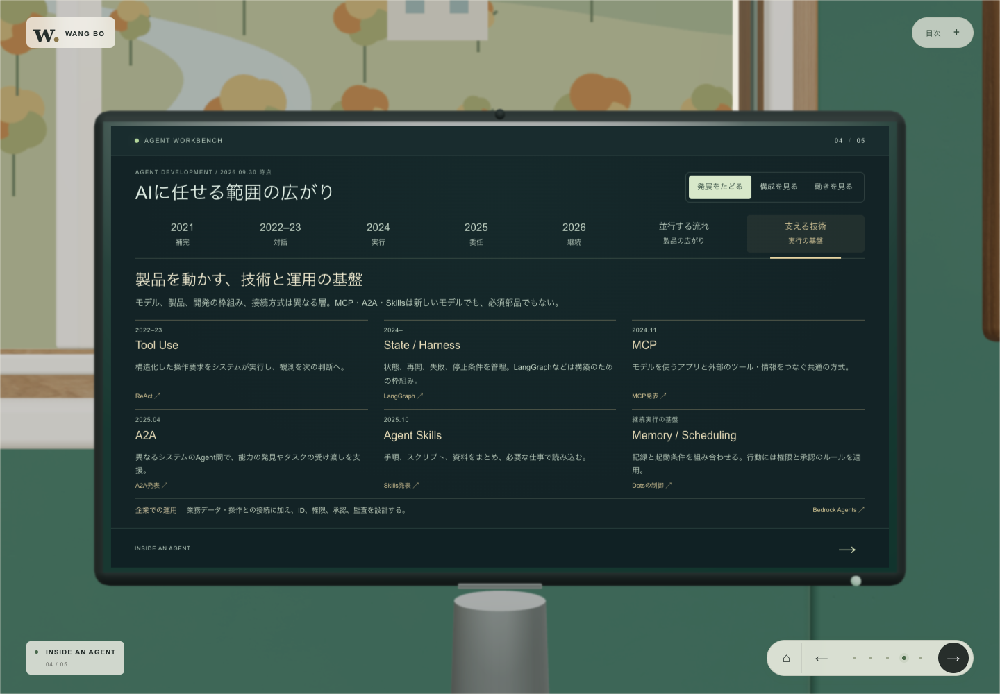
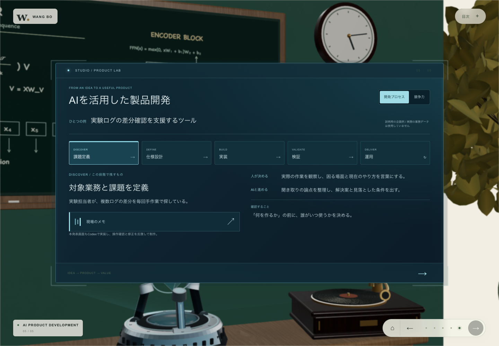
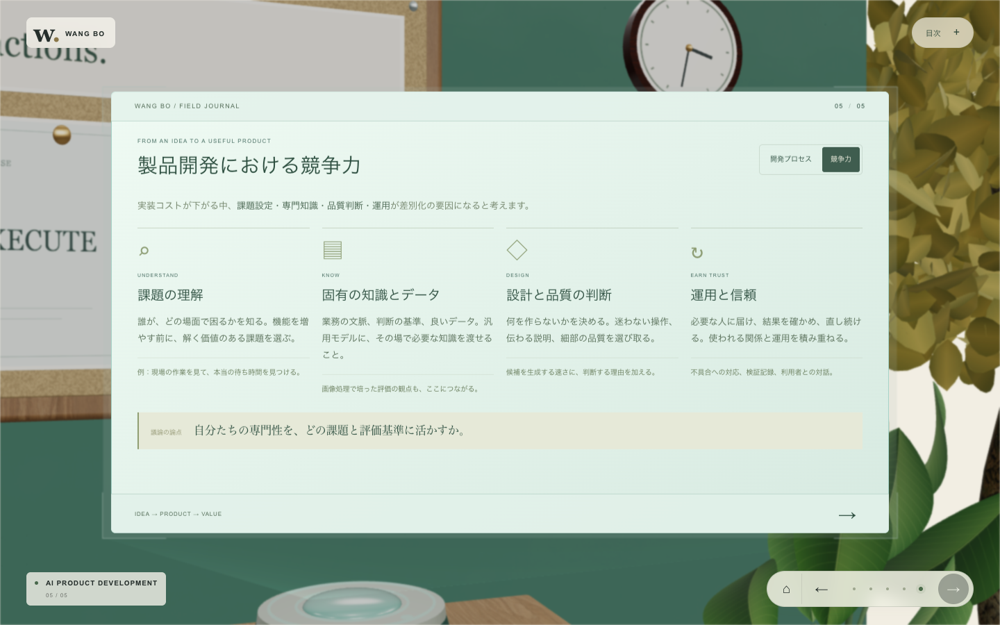

## 房间、材质与操作

首页不设左右分栏说明，整个房间居中呈现。全景没有数字、圆圈、勾选、进度条或常驻悬浮名称；悬停或键盘聚焦时才出现简短名称，物件展示面轻微提亮。底部保留一个简短开始入口，「目次」提供五章及资料入口。已确认的设计方向记录在 [AGENTS.md](AGENTS.md)，参考案例不作为逐项实施清单。

个人笔记合放在中央茶几，参考书合放在书架内，电脑与黑板保持可见，黑板与后窗拉开间隔。钟下改为胡桃木底座、黄铜喇叭的唱片机，柜面另有书册和绿植。亚麻沙发、羊毛搭毯、茶几与地毯形成完整的阅读区域；书架减少重复书脊，增加横放的书和文件盒；桌面有图像比较稿和检查便签。右侧树木后移、树冠缩小，草花整理为三组种植区。暖白墙面、木地板和接触阴影加强了材质区分。

现有27张本地公共 PBR 贴图用于橡木、织物、羊毛、树皮、砂岩和草地等；本轮细调木纹法线、缎面木蜡油、皮革、拉丝金属和釉面陶瓷的粗糙度与表面反射，来源与许可见 [CREDITS.md](public/materials/studio/CREDITS.md)。原有公共素材均保留在本地，不依赖在线图片加载。四季庭园使用新生成的同场景图集，结合时间与天气着色、窗面雨雪和动态天空。素材文件、完整生成提示词与来源说明见 [环境素材记录](public/environments/CREDITS.md)，使用内置 ImageGen 生成。

- 全景默认播放克制的生活动效；系统设置“减少动态效果”时静止。小鸟新增连续羽色、逐片重叠飞羽、关节翼、尾羽、眼部反光和脚趾，沿庭院外侧独立飞行、停歇，不响应章节或跟随镜头。机器人沿家具外侧巡行，咖啡在桌面前侧冒出细小热气，水面、蝴蝶和树叶缓慢运动。阅读与资料窗口暂停环境动效。
- 显示器后方新增真正的墙体开口；两扇窗包含木框、密封条、玻璃、铰链、把手与窗台。太阳、阴影和窗内光束使用同一空间方向；光束仅在阳光朝向开口时出现，并截止于室内边界。移除原先与太阳无关的固定斜光带。
- 全息投影器采用钛色分层底座、三组关节发射臂、玻璃镜头、悬浮晶体及双轴光环。镜头先对准仪器并短暂停留，再展开青蓝色光幕；光幕使用深色技术界面，扫描效果只用于展开阶段。模型保持固定尺寸，调整窗口大小也不重复播放靠近仪器的过程。
- 窗景依据 Open-Meteo 的当前天气、当地日期和太阳位置变化，15分钟刷新，隐藏页面暂停请求。默认地点明确为东京；菜单内可搜索城市，或点击后授权使用浏览器定位，坐标保留至约0.01度。未授权时不请求定位。城市偏好仅保存在本地。
- 「季節・天気を試す」提供春夏秋冬、明け方／朝／昼／夕暮れ／夜／深夜，以及晴／曇／雨／雪／霧／雷雨。预览模式明确标记；获取失败时显示前次数据或预览，不宣称实时。夜间减弱日照，已开启的桌灯与落地灯增强暖光；用户关闭的灯不会被天气更新重新打开。窗景是生成素材与程序天气效果的组合，不是城市实景摄像头。墙钟读取设备实际当地时间，与所选城市和环境预览时间独立；场景静止时也会在分钟变化后刷新。
- 缩放与「視点を戻す」也收在环境菜单中。关闭章节后回到离开前的旋转角度和缩放；访问记录继续保存，不显示计数或完成标记。
- 普通物件间镜头移动约2秒，全息展示约3.4秒，使用五次缓动，并在移动过程中逐渐注视目标。终点独立于书的展开动画，避免追随模型变形而上下回摆。途中可以改选章节；不提供跳过移动按钮；减少动态效果模式直接到位。
- 五个内容展示面保持挂载，分别映射到三个物件。个人本子默认合上，选择时打开，第二章延续同一打开状态，离开时合回。书架上的参考书始终留在书架；墙面黑板保留原创 Transformer 注意力公式与编码器草图。点击黑板直接靠近；实体粉笔或底部粉笔按钮进入书写模式，实体板擦或底部板擦按钮进入擦除模式。离开再回来保留笔迹，刷新恢复原草图，笔迹不进入 localStorage、sessionStorage 或网络。黑板不对应章节展示页。内容直接投影在物件表面，交互在停靠与展开完成后启用。
- PC 展示利用顶部标识与底部导航之间的空间，文字、控件、图解和页脚都限制在纸张 / 屏幕内部。正文期间停止环境动画，静止后停止连续绘制，仅在时钟分钟变化等必要更新时重绘。用户主动播放的音乐可继续，唱片保持转动。
- 「目次」内的「過去の資料」保留20页资料及搜索；讲者备注、计时器、键盘导航、Atlas 和3D失败时的文字备用页保留。

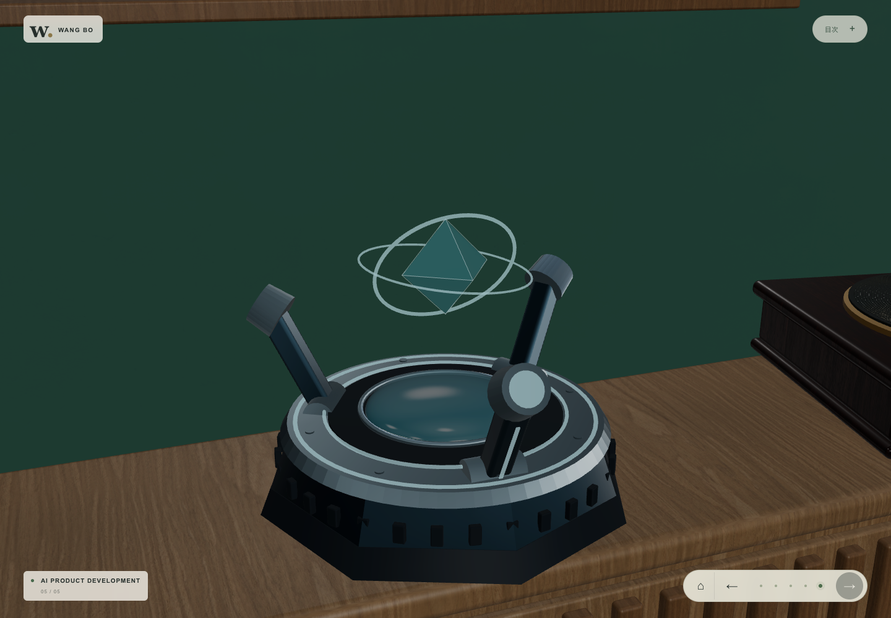
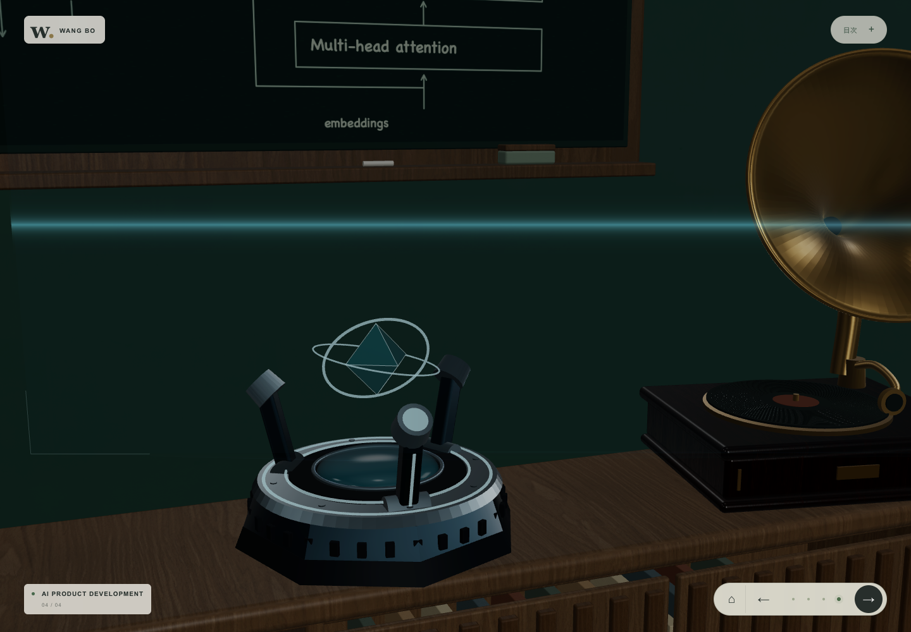
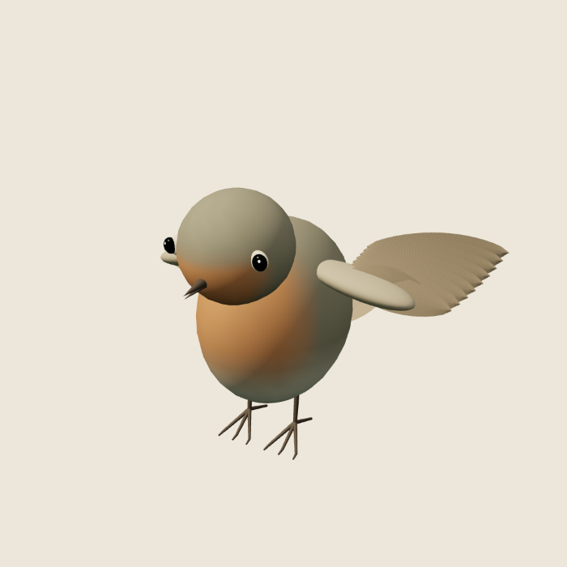

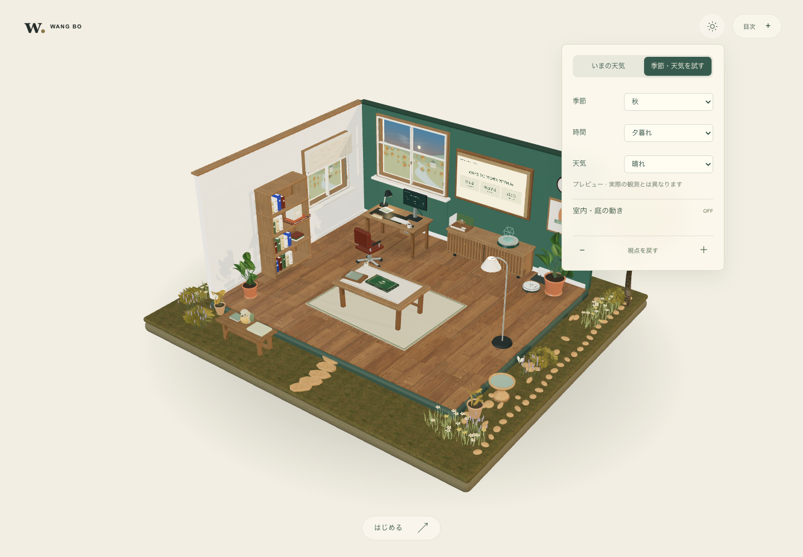
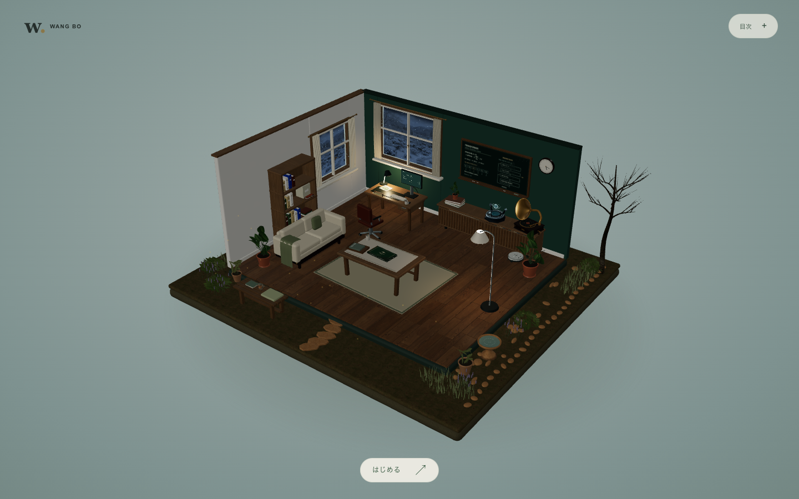
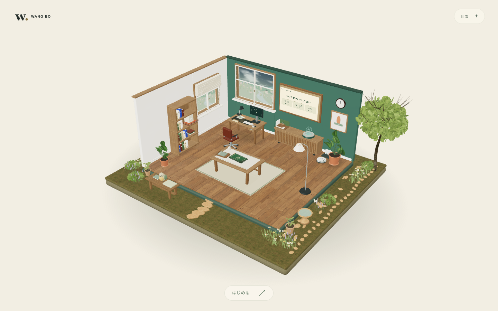

窗景与光照依据 [Open-Meteo 当前天气接口](https://open-meteo.com/en/docs)、[城市搜索接口](https://open-meteo.com/en/docs/geocoding-api) 和 [NOAA 太阳位置近似公式](https://gml.noaa.gov/grad/solcalc/solareqns.PDF)。蒸汽效果由本人 `my_3d_test` 项目的实现复用并适配；窗框、机器人和环境管理参考同项目后按本房间比例重新实现。没有修改该参考项目。

## 生活物件交互

- 两扇窗均有独立开合的亚麻窗帘、黄铜轨道和吊环。褶皱沿轨道聚拢；闭合后阻挡窗内光束。
- 点击物件后镜头直接靠近，不出现侧边说明页。灯、窗帘、黑板、唱片机、咖啡、沙发、椅子、绿植、柜门、墙钟、机器人提供13个可键盘访问的生活入口；名称只在悬停与聚焦时出现。
- 桌灯与落地灯独立开关。柜门绕铰链打开，内部有隔层、唱片与织物收纳盒，椅子轻轻转向，坐垫微微下沉，绿叶摆动，咖啡热气短暂增强。机器人可停止、重新运行，路线避开新增沙发。
- 唱片机包含唱片刻纹、可摆动唱臂、针头、弯曲黄铜颈管、双层喇叭口、卷边、加强筋与手摇柄。音乐为原创 Web Audio 合成音序，不下载第三方录音。仅点击后播放；支持暂停和音量调节，隐藏页面时停止，重新载入保持静音。
- 黑板编辑作用于模型使用的同一张画布，交互区对齐真实板面。画布与 WebGL 场景分别验证，粉笔与板擦的实体点击也已覆盖。

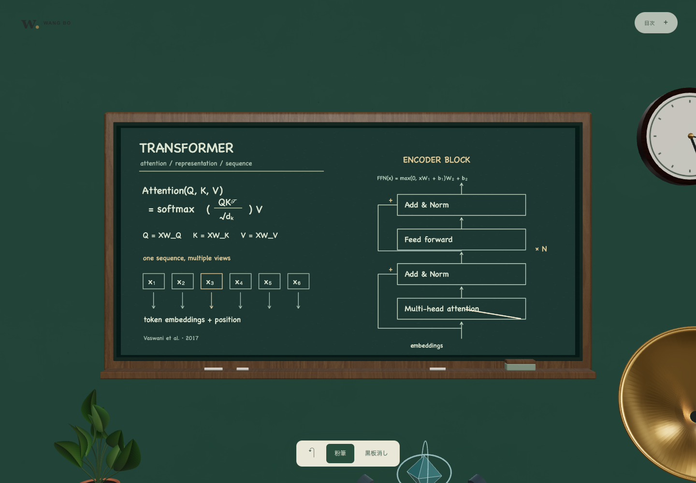

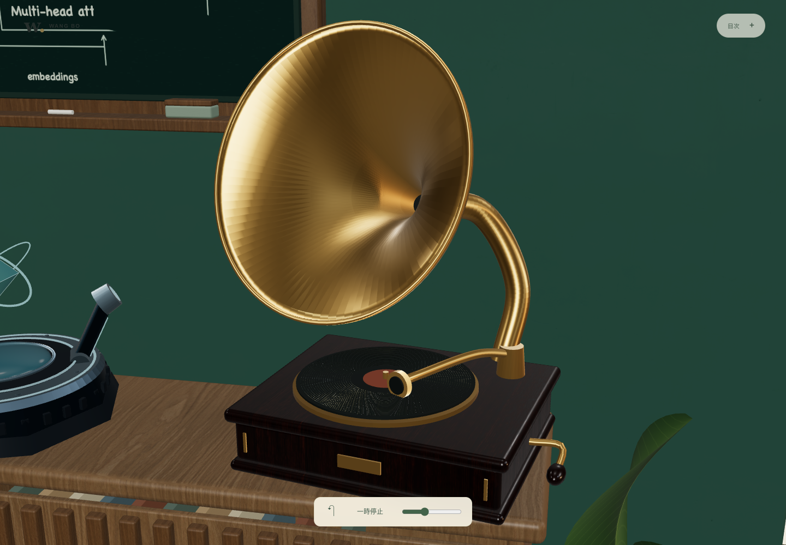
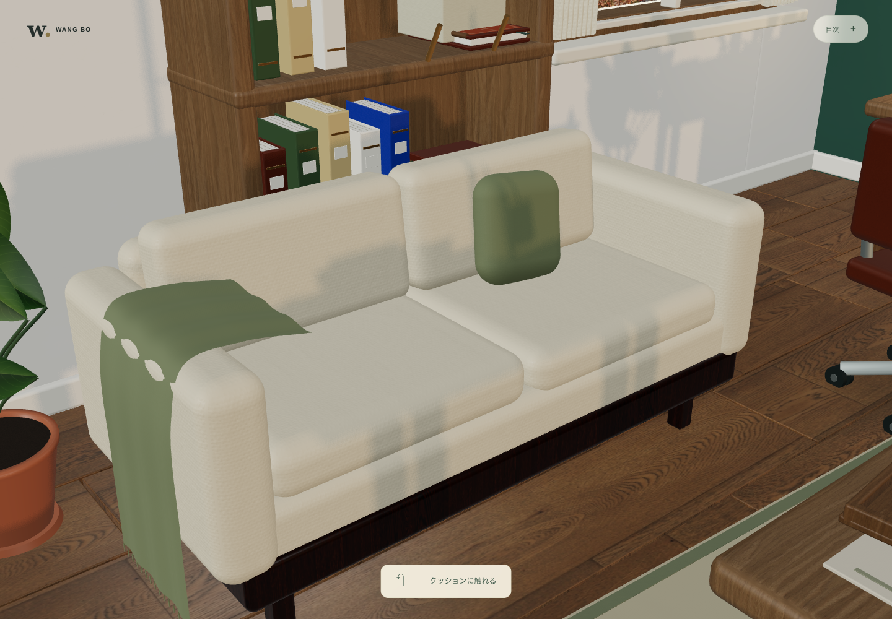

## 内容依据

工作经历及个人使用体验来自本人提供的信息；技术说明对照 [Transformer 原论文](https://arxiv.org/abs/1706.03762)、[ViT 原论文](https://arxiv.org/html/2010.11929v2) 和 [Building effective agents](https://www.anthropic.com/engineering/building-effective-agents)。Harness 边界参考 [Scaling Managed Agents](https://www.anthropic.com/engineering/managed-agents)。六个技术背景节点各自保留论文或官方说明链接。

## 验证

本次生产版本 **70 / 70 项检查通过**，覆盖192个正文页面状态，并额外检查四季、六个时段与六类天气。五章展示27项、庭院10项、环境与生活动效9项、逐帧凝视与展开6项，公共材质与独立Atlas6项，生活交互与翻页12项；TypeScript、修改范围ESLint、生产构建均通过。检查结果保存在 [verification.json](docs/model-presentation/verification.json)。检查范围包括 PC 版面、隐藏标签与简洁入口、物件点击、连续运镜、参考资料、文字备用页、WebGL 恢复和庭院操作。PC 窗口为1920×1080、1680×1050、1440×900、1366×768、1280×720、1024×768；不开展手机端优化和触控回归。

常见 PC 窗口（1280×720及以上）的五章主内容和隐藏状态均检查无需滚动；1024×768保持区域内阅读和操作。同时检查技术背景弹窗、Agent 节点与结果框、新增发展介绍的文字边界。发展介绍七个状态均保持电脑视角，支持逐段前后翻页与键盘切换，并在进入时停止执行演示。本轮重新验证直接凝视、书本展开、资料恢复与 WebGL 备用显示，并检查同物件内翻页不运镜、四季窗景、真实墙钟、全息注视与展开的先后顺序、固定底座和独立生活动效。

[上一版性能采样](docs/model-presentation/performance.json)记录本机 Chrome 的四段连续切换；刷新回调包含抵达后的空闲时间，不能当作 GPU 帧耗时或跨设备性能承诺。本次调整共享材质参数，重新运行材质加载、失败降级与独立Atlas模型检查。

```sh
pnpm typecheck
pnpm build
node tests/studio-fullscreen.test.mjs
node tests/garden.test.mjs
node tests/studio-gaze.test.mjs
node tests/studio-environment.test.mjs
node tests/materials.test.mjs
node tests/studio-interactions.test.mjs
```

浏览器脚本需已启动本地服务，默认 `http://127.0.0.1:5173/`；支持 `STUDIO_URL`、`PLAYWRIGHT_MODULE`、`PLAYWRIGHT_CHANNEL`。没有新增运行依赖。
