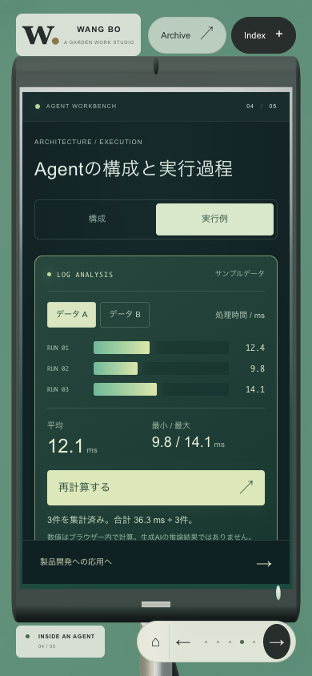
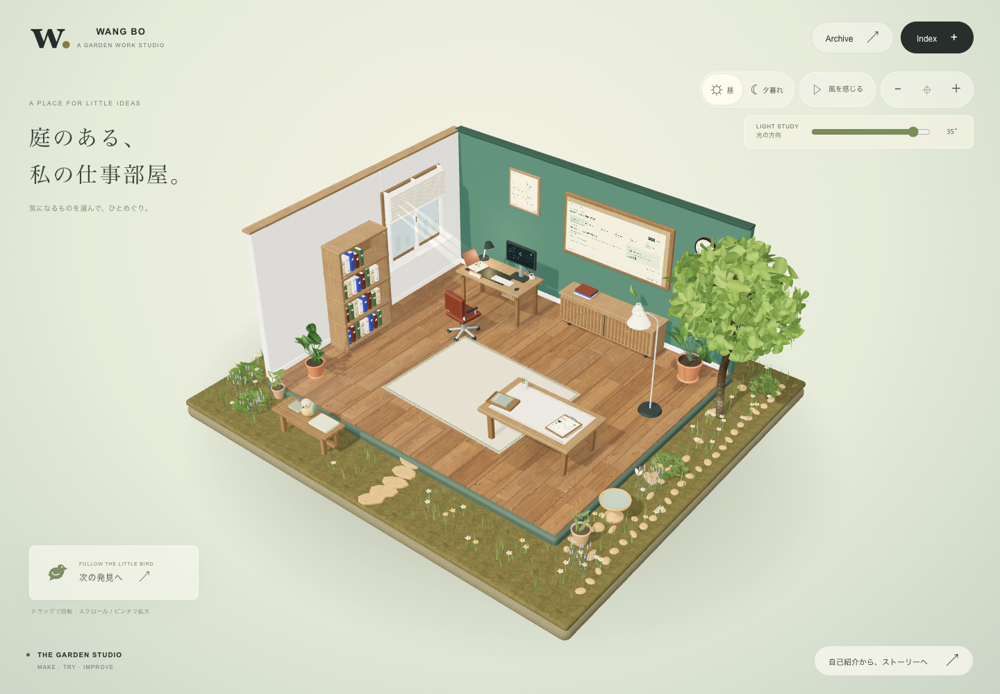

# 模型就是展示区域

2026-09-29 更新。首页直接进入个人介绍，五个章节分别显示在模型的实际表面。点击“下一章”从当前镜头直接移到下一件物品；只有主动选择全景、自由探索或结尾探索按钮时才回到庭院。五个展示面始终存在于场景中，随同一台相机连续投影；不再等镜头抵达后才出现正文。Agent 示例重做为可交互的日志统计，五章文案以简洁、可说明的专业表述为主。


## 五章主线

| 章节 | 模型与版式 | 主要内容 | 操作込み目安 |
| --- | --- | --- | --- |
| 自己紹介 | 白橡木履历框，履历时间线 | 自然问候与工作经历；KIOXIA、Hightech、Multi Beam 和 ADC | 0:00–1:35 |
| 画像分類でのTransformer活用 | 打开的笔记本，可分离和选择的 ViT 分块图 | 分类效果改善的个人经验；少量数据下 ResNet 的表现与训练条件 | 1:35–2:50 |
| LLMの発展と利用経験 | 研究板，技术发展 / 个人体会双视图 | Transformer、事前学习、SFT / RLHF、多模态、工具、推理与执行六个节点；另保留个人使用历程 | 2:50–5:00 |
| Agentの構成と実行過程 | 放大的电脑屏幕，深青色工作台 | 五个组件的职责、输入输出、设计要点；Context / Memory / RAG 的区别；日志读取、验证、计算和结果照合 | 5:00–7:10 |
| AIを活用した製品開発 | 应用清单，制作流程 / 竞争力双视图 | 日志比较工具的五步企划例；人和 AI 各自的工作、完成条件；问题理解、领域知识、设计判断、信任与改善 | 7:10–10:00 |

完整日语讲稿见 [STUDIO_SCRIPT_JA.md](STUDIO_SCRIPT_JA.md)，与界面讲者备注保持一致。最后一章不再展示截图，先介绍产品制作过程，再通过页尾按钮进入竞争力讨论，最后自由探索。主线约 10 分钟，逐项深入时可延长时间。


## 展示与操作

- 正文使用可选择、可聚焦的网页文字，五个展示面从全景起持续投影在模型表面。运镜过程中内容保留，抵达后启用该展示面的交互；其他面的控件不参与键盘导航。内容面占物理表面的 98%，露出纸张或屏幕的窄边，限制所有内容在模型内部。
- 常见桌面尺寸下整章无需滚动；窄屏和较矮窗口使用区域内滚动，页尾按钮始终留在展示区域内。标题、图解、按钮和长文字均检查横向边界。
- 家具、相框和书架改为细白橡木纹；地毯的薄本体、缝边和流苏属于同一坐标系。新增羊毛、树皮、砂岩与草地扫描材质，共 27 张本地 PBR 贴图，见 [素材出处与许可](public/materials/studio/CREDITS.md)。
- 庭院增加低矮叶丛、薰衣草花境、陶盆、石材鸟浴盆、分离的踏步石、长椅软垫与书本，桌面增加织物托盘和笔筒。植物轻摆、蝴蝶飞行、水面涟漪与夕暮萤火虫营造安静的动态环境。
- ViT 图支持分离滑杆和16个分块的选择，显示对应的 Patch → Embedding → Transformer 路径。这是结构概念图，不展示伪造的 Attention 或模型性能。
- 全景增加光照方向滑杆，改变真实场景的光照与阴影；窗边光束、微尘、数据条动画和结果扫光提供视觉反馈。减少动态效果模式保留手动交互。
- 全景没有圆圈、数字或连线标记。直接点物件，或悬停 / 键盘聚焦显示名称；保留小鸟导览与 44px 透明操作入口。
- 章节间运镜约 2 秒，采用五次缓动，让起步和停靠更柔和；回庭院约 2.2 秒。途中可改选章节或跳过，减少动态效果模式直接到位。
- 页尾圆点、左右按钮和 Index 可以切换章节；标题取得焦点时也可用方向键。Esc / 全景按钮回庭院。
- 首页每次从个人介绍开始，Agent 演示步骤可在当前会话中恢复。资料页保留 20 页，庭院保留六处探索入口；资料搜索、讲稿计时、昼夕切换和 Atlas 保留。
- 3D 不可用时，显示同样的文字与交互内容，并提供重新加载入口。




## 内容依据

工作经历与使用体验根据本人提供的信息展开；2023 年入职时间沿用原项目自我介绍。VGG → ViT 的提升及少数据下 ResNet 的优势限定为本人任务的实验经验。GPT、工具与 Agent 的顺序表达个人使用体验，不当作研究或产品公开年表。

五个 Agent 组成部分是帮助理解职责的整理。技术背景参考 [ViT 原论文](https://arxiv.org/abs/2010.11929)、[OpenAI Function calling](https://developers.openai.com/api/docs/guides/function-calling)、[Anthropic Building effective agents](https://www.anthropic.com/engineering/building-effective-agents) 与 [Codex 官方资料](https://learn.chatgpt.com/docs)。未补写个人业绩数字、实际制作耗时或产品发布顺序。

Agent 执行例使用两组说明用计测数据，点击“要約を計算”实际计算平均、最小和最大值；A组为12.4、9.8、14.1 ms，B组为12.4、28.6、14.1 ms，平均分别为12.1和18.4 ms（四舍五入至一位小数）。可逐步查看取得输入、验证、集计、照合与报告的固定工程；此部分明确标为本地机制演示，没有实时AI调用。已移除故意越界的假按钮。结尾的日志比较工具是说明用的企划例，不声称是已部署产品或实际业绩。竞争力四个方向表达讲者的观点。

LLM 的六个节点各附原论文 / 官方说明，公开技术发展与个人体验分开展示。新增依据包括 [Transformer](https://arxiv.org/abs/1706.03762)、[GPT-3](https://arxiv.org/abs/2005.14165)、[InstructGPT](https://arxiv.org/abs/2203.02155)、[GPT-4](https://arxiv.org/abs/2303.08774)、[Toolformer](https://arxiv.org/abs/2302.04761)、[SWE-agent](https://arxiv.org/abs/2405.15793) 和 [DeepSeek-R1](https://arxiv.org/abs/2501.12948)。




## 验证

本轮生产导出包上完成 **46 / 46 项检查**，详细记录见 [verification.json](docs/model-presentation/verification.json)。

| 范围 | 结果 |
| --- | --- |
| 五章模型展示 | 30 / 30：个人内容、连续运镜、途中改选与跳过、模型贴合、组件和页内切换、两组日志统计、ViT分块交互、资料返回、旧配置兼容、键盘、讲稿计时、触控、备用页面与 WebGL 恢复 |
| 庭院回归 | 10 / 10：连续展示面、光照方向、无数字标记与名称聚焦、昼夕、六处导览与进度恢复、旋转缩放复位、44px 入口、双指缩放、动效暂停 |
| 材质与 Atlas | 6 / 6：27 张本地贴图、延迟加载、丢失贴图时可用、五件物品近景、Atlas 13 资产的两种视图、无浏览器或着色器异常 |
| 屏幕尺寸 | 1440×1000、1366×768、1024×768、820×1180、768×1024、390×844、375×667、320×568、844×390、667×375、720×500 |
| 静态检查与构建 | TypeScript、新工作室及相关修改范围 ESLint、生产构建通过；旧资料组件未在本轮修改；构建保留模块包体大小提示 |

[流畅度采样](docs/model-presentation/performance.json)记录本机 Chrome 的四段连续切换。浏览器刷新回调包含抵达后的空闲回调，不代表 GPU 帧耗时或跨设备表现。静止近景停止连续绘制，庭院微动限制刷新频率。

复现：

```sh
pnpm typecheck
pnpm build
node tests/studio-fullscreen.test.mjs
node tests/garden.test.mjs
node tests/materials.test.mjs
node tests/interactions.test.mjs
node tests/studio-performance.mjs
```

浏览器脚本需已启动本地服务，默认 `http://127.0.0.1:5173/`；支持 `STUDIO_URL`、`DECK_URL`、`PLAYWRIGHT_MODULE`、`PLAYWRIGHT_CHANNEL`。无需仓库外的固定机器路径，没有新增运行依赖。
