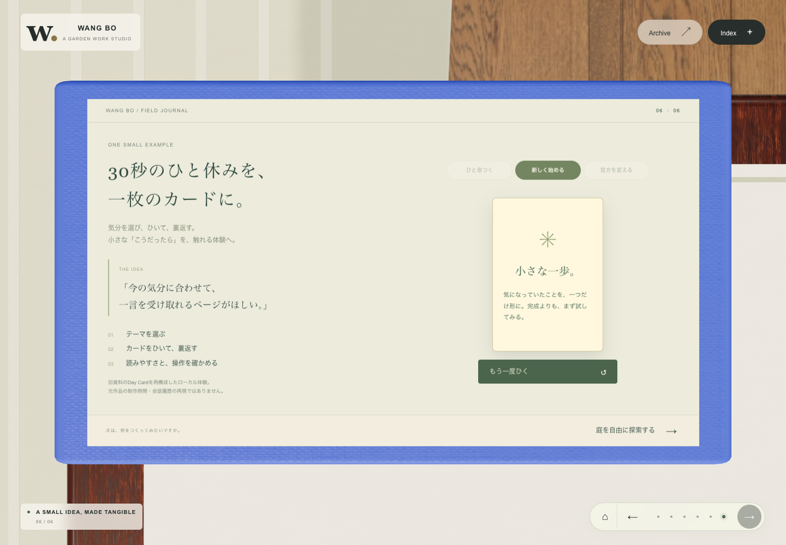

# 模型就是展示区域

2026-09-29 更新。首页直接进入个人介绍，六个章节分别显示在模型的实际表面。点击“下一章”从当前镜头直接移到下一件物品；只有主动选择全景、自由探索或结尾探索按钮时才回到庭院。原来的右侧内容浮层已移除。


## 六章主线

| 章节 | 模型与版式 | 主要内容 | 操作込み目安 |
| --- | --- | --- | --- |
| 私について | 木质履历框，履历时间线 | KIOXIA、Hightech 的图像处理工作，Multi Beam 兼任和 ADC 开发 | 0:00–1:35 |
| Transformerとの出会い | 打开的笔记本，VGG / ViT 对照 | 分类效果改善的个人经验；少量数据下 ResNet 的表现与训练条件 | 1:35–2:50 |
| LLMからAgentへ | 研究板，三张可选阶段卡 | 2022 年初次体验 GPT → API 自制工具 → OpenClaw、Claude Code、Codex 的个人使用历程 | 2:50–5:00 |
| Agentは何でできている？ | 放大的电脑屏幕，深青色工作台 | Model、Context、Tools、Harness、Loop；发现溢出、修正和复查 | 5:00–7:10 |
| アイデアを、動くものに | 应用清单，实物截图与三种用途 | 以本界面为制作例，连接可视化、日常小工具与交互说明 | 7:10–8:20 |
| 小さな例：Day Card | 卡牌盒上的体验面 | 选择心情、抽卡、翻面、再试一次 | 8:20–10:00 |

完整日语讲稿见 [STUDIO_SCRIPT_JA.md](STUDIO_SCRIPT_JA.md)，与界面讲者备注保持一致。每章末尾有通往下一件物品的过渡。




## 展示与操作

- 正文使用可选择、可聚焦的网页文字，按同一台 3D 相机投影到模型表面。边框、纸张、电脑与内容保持贴合。
- 当前物件的比例随展示区域调整；窄屏改为竖向排版，正文在物件内部滚动，下一章按钮固定在底部。
- 保留纸张、木纹与金属的精细材质；电脑采用深青与淡绿，其他章节用暖纸色和植物绿，形成统一的展示语言。
- 相机从当前位置平滑移动约 1.5 秒。途中可改选章节或跳过；抵达前内容不接受点击，抵达后焦点移到标题。减少动态效果模式直接到位。
- 页尾圆点、左右按钮和 Index 可以切换章节；标题取得焦点时也可用方向键。Esc / 全景按钮回庭院。
- 首页每次从个人介绍开始，抽卡结果和 Agent 演示步骤可在当前会话中恢复。原 24 页资料、资料搜索、讲稿计时、庭院探索、昼夕切换和 Atlas 保留。
- 3D 不可用时，显示同样的文字与交互内容，并提供重新加载入口。


## 内容依据

工作经历与使用体验根据本人提供的信息展开；2023 年入职时间沿用原项目自我介绍。VGG → ViT 的提升及少数据下 ResNet 的优势限定为本人任务的实验经验。GPT、工具与 Agent 的顺序表达个人使用体验，不当作研究或产品公开年表。

五个 Agent 组成部分是帮助理解职责的整理。技术背景参考 [ViT 原论文](https://arxiv.org/abs/2010.11929)、[OpenAI Function calling](https://developers.openai.com/api/docs/guides/function-calling)、[Anthropic Building effective agents](https://www.anthropic.com/engineering/building-effective-agents) 与 [Codex 官方资料](https://learn.chatgpt.com/docs)。未补写个人业绩数字、实际制作耗时或产品发布顺序。

Agent 动作和 Day Card 是本地演示，没有接入实时 AI。Day Card 根据旧材料重构，用来体验“想法变成可操作页面”，不声称重现原作品的真实开发历史。应用页截图来自本项目自己的庭院页面。

## 验证

生产导出包上完成 **32 / 32 项检查**，详细记录见 [verification.json](docs/model-presentation/verification.json)。

| 范围 | 结果 |
| --- | --- |
| 六章模型展示 | 19 / 19：个人内容、下一章直接运镜、途中改选与跳过、模型贴合、五个 Agent 组件、真实宽度溢出 / 修复、抽卡、资料返回、键盘、讲稿计时、触控、备用页面与 WebGL 恢复 |
| 庭院回归 | 7 / 7：昼夕、七处导览与进度恢复、旋转缩放复位、44px 入口、双指缩放、动效暂停 |
| 材质与 Atlas | 6 / 6：13 张本地贴图、延迟加载、丢失贴图时可用、六件物品近景、Atlas 13 资产的两种视图、无浏览器或着色器异常 |
| 屏幕尺寸 | 1440×1000、1366×768、820×1180、390×844、320×720 |
| 静态检查与构建 | TypeScript、修改范围 ESLint、生产构建通过；保留 Three.js 等模块的包体大小提示 |

[流畅度采样](docs/model-presentation/performance.json)：本机 Chrome / Apple M4 Metal 在五段连续切换中保持标准画质，1.5 秒运镜约绘制 91–92 帧。约 2.1 秒采样窗的浏览器刷新回调为 60.1–60.2 次/秒；该指标含抵达后的空闲回调，不是 GPU 帧耗时或跨设备承诺。静止近景停止连续绘制，庭院微动实测 1.1 秒绘制 33 帧。

复现：

```sh
pnpm typecheck
pnpm build
node tests/studio-fullscreen.test.mjs
node tests/garden.test.mjs
node tests/materials.test.mjs
node tests/studio-performance.mjs
```

浏览器脚本需已启动本地服务，默认 `http://127.0.0.1:5173/`；支持 `STUDIO_URL`、`PLAYWRIGHT_MODULE`、`PLAYWRIGHT_CHANNEL`，无需仓库外的固定机器路径。没有新增运行依赖。
