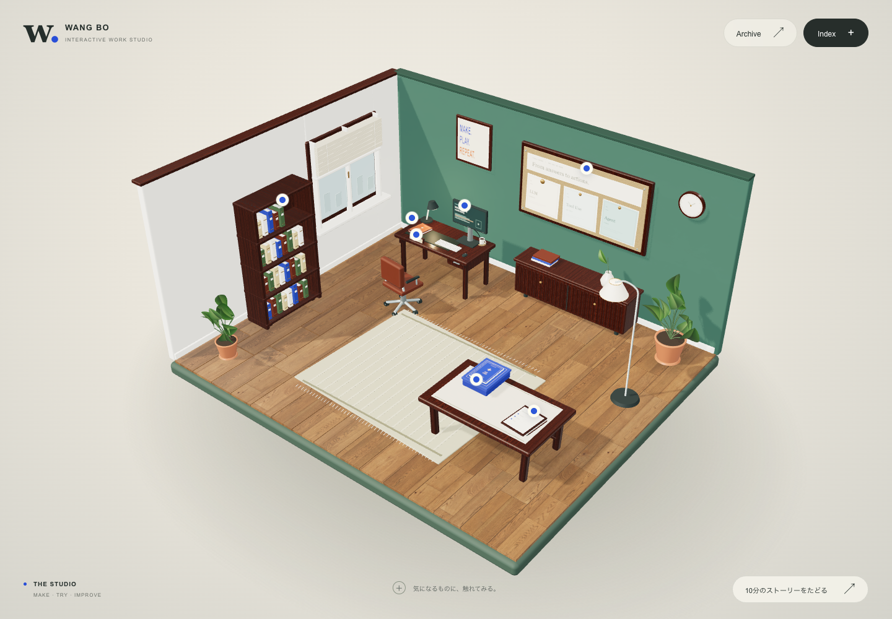
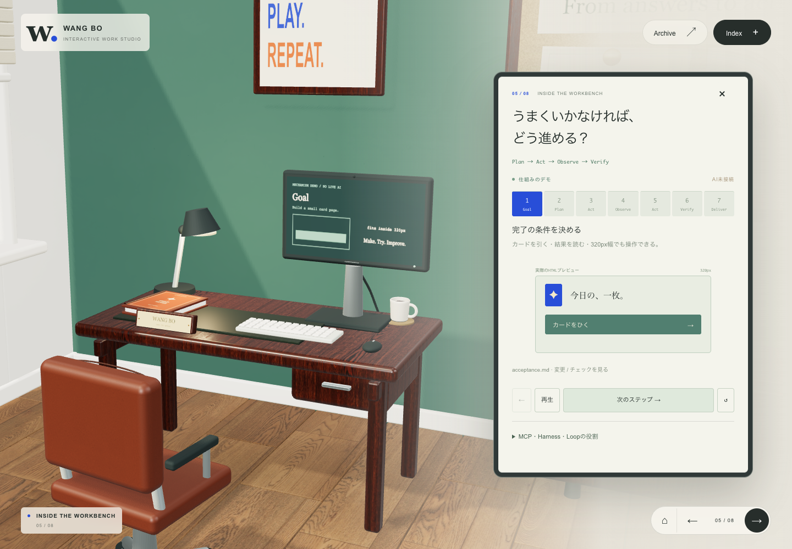

# 模型与材质细化 · 2026-09-28

主工作室和 Atlas 共用一套物理材质库。加入 13 张本地 PBR 贴图
（6,251,854 字节，约 5.96 MiB），保留原布局、镜头、章节和操作。



## 覆盖范围

| 物件 | 细化内容 |
| --- | --- |
| 地板、墙体、窗户 | 浅木地板错缝与色差、真实纹理和法线；墙面细颗粒；玻璃反射、窗扣、百叶织纹与拉绳 |
| 书桌、作品桌、资料柜、书架、相框 | 深木材纹理、米制 UV、清漆反光；桌下围板、五金、柜门缝与黄铜把手 |
| 椅子 | 染色皮革、包边、背垫压扣、金属支撑及双轮脚轮 |
| 显示器、键盘、鼠标、灯具 | 磨砂外壳、金属支架、屏幕反光、散热槽、摄像头、逐键字符；布灯罩、金属包边和内置灯泡 |
| 杯子、花瓶、盆栽 | 有壁厚的旋转曲面、杯口与液面、软木杯垫、陶瓷釉面；弯曲叶片、叶脉、枝茎和土壤 |
| 地毯、桌垫、书本、笔记本 | 织物法线与绒面反光、流苏、皮革桌垫；独立封面、书芯、脊背、金色装饰带、书页与书签 |
| 铭牌、研究板、卡盒、卡片、检查单 | 按实物比例排版；软木底板、独立纸卡与铜钉；织物卡盒、内衬、双面卡牌、纸纤维、夹扣、铆钉和铅笔 |
| Atlas | 13 个已有 GLB 按木材、布、皮革、橡胶和金属分别处理；新增独立 UV 通道；所有工作站增加表面微细节，机架增加通风孔，平台增加螺钉 |

Atlas 覆盖 `bookcaseOpen`、`books`、`desk`、`computerScreen`、
`computerKeyboard`、`computerMouse`、`chairDesk`、`robot-arm-b`、`oopi`、
`cog-a`、`scanner-high`、`conveyor`、`screen-wide`。原始 GLB 和调色板贴图未改写。



## 材质与运行

- 摄影 PBR 素材来自 Poly Haven，使用 CC0 许可。来源、原文件校验值和用途见
  [素材记录](public/materials/studio/CREDITS.md) 与 [manifest](public/materials/studio/manifest.json)。
- 颜色贴图采用 sRGB；法线和粗糙度按线性数据采样。地板、家具及薄边使用按物理尺寸生成的 UV；Atlas 保留原配色 UV。
- 纸张、软木、拉丝金属与釉面微纹理、叶脉和印刷图形在本地生成。几何细化由现有 Three.js 完成，没有新增运行依赖。
- 材质按场景缓存，静态物件继续按交互归属合批。贴图延迟到达会唤醒渲染，加载完毕后继续按需渲染。场景退出时释放材质、贴图与环境反射。
- 修正 Three.js 0.186 已移除的阴影类型；避免把长时间静止后的第一帧误计为持续低帧率。
- 修正 `pnpm-workspace.yaml` 中构建脚本许可的占位文本，使当前 pnpm 可正常安装和构建。

## 验证

- `pnpm install --frozen-lockfile`、`pnpm typecheck`、修改文件的 ESLint 检查和 `pnpm build` 通过。
- 工作室原有 22 项回归通过：全部物件、Agent 步骤、抽卡翻面、归档、键盘、320px–1440px 布局、触控和 WebGL 恢复。
- Atlas 14 项回归通过：13 个模型、全部构成节点与历史节点、模型点击、资料跳转、嵌入模式和手机操作。测试改用当前 `/reference/` 入口，并移除固定 Windows 路径。
- 新增材质测试 6 项在开发版与静态生产版均通过：贴图校验、延迟加载后重绘、恢复静止、全部近景、两种 Atlas 模式、缺失贴图时的可操作性和浏览器/着色器错误检查。
- Apple M4 / Chrome / Metal，1440×1000，五段镜头的 rAF 约 60.1–60.2 fps，保持标准画质；全景 114 次绘制、约 23 万三角形。此为本机检查，不代表所有设备。
- 构建仍有原项目的大型公共依赖块提示（超过 500 kB）。未测试真实手机的长期热稳定性。

截图来自最终静态生产包。完整本地记录保存在被 Git 忽略的 `output/playwright/`。
测试可使用已安装的 Playwright，或通过 `PLAYWRIGHT_MODULE` 指向现有运行时的
`index.mjs`。`PLAYWRIGHT_CHANNEL` 选择浏览器，`STUDIO_URL` 选择服务地址。

```sh
node tests/materials.test.mjs
node tests/atlas.test.mjs
```
